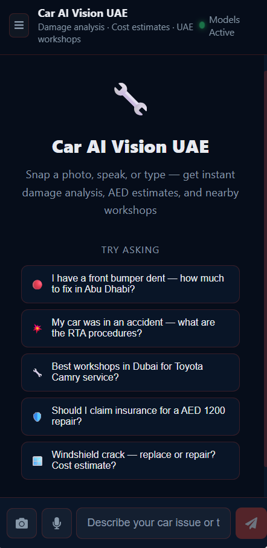
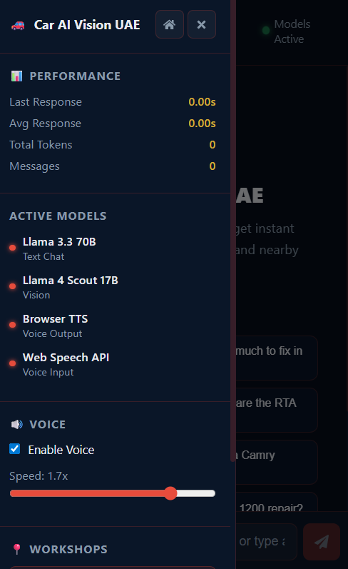

# Car AI Vision UAE

> A production-grade, multimodal AI assistant for car damage assessment, repair cost estimation, and workshop discovery across the UAE — built with Vision LLMs, real-time streaming, and voice-first interaction.

**Live Demo:** [https://kesaavraj.github.io/Car_ai_vision_UAE](https://kesaavraj.github.io/Car_ai_vision_UAE)

---

## Application Screenshots

### Desktop

**Product Overview — entry point with live model indicator, damage severity samples, and direct access to the AI assistant**


---

**Three-Step Workflow — snap or speak, AI analyses, receive cost estimate and repair plan**


---

**Capability Overview — eight core features including camera vision, voice I/O, AED cost estimation, insurance guidance, and live workshop discovery**


---

**AI Assistant Interface — performance metrics panel on the left (response latency, token count), active model indicators, voice speed control, and five domain-specific quick prompts**


---

**Live Damage Analysis — Vision LLM output for an uploaded car image: structured assessment with part identification, severity grading, AED cost range, and curated workshop recommendations by emirate**


---

### Mobile

Fully responsive across all screen sizes. Camera and microphone inputs are accessible directly from the input bar — no extra navigation required on mobile devices.

<table>
  <tr>
    <td align="center"></td>
    <td align="center"></td>
    <td align="center"></td>
  </tr>
  <tr>
    <td align="center"><b>Product Overview</b><br/>Responsive layout with stacked CTAs — camera and voice access on first screen</td>
    <td align="center"><b>Chat Interface</b><br/>Full-width conversation view with camera and microphone icons in the input bar for one-tap access</td>
    <td align="center"><b>Control Panel</b><br/>Slide-out panel showing active models, real-time performance metrics, voice speed slider, and workshop finder</td>
  </tr>
</table>

---

## What It Does

Drivers in the UAE can:

1. **Upload or photograph car damage** — the Vision LLM analyzes the image and returns a structured damage report with affected parts, severity, and repair cost estimates in AED
2. **Ask follow-up questions via text or voice** — a conversational LLM handles multi-turn dialogue about UAE insurance claims, RTA procedures, and repair advice
3. **Find nearby workshops** — GPS-based discovery queries the OpenStreetMap Overpass API within a 15 km radius, supplemented by a curated database of verified UAE workshops across 6 emirates
4. **Hear responses spoken aloud** — integrated Text-to-Speech with adjustable speed for hands-free use

---

## Architecture Overview

```
┌─────────────────────────────────────────────────────────┐
│                     React 19 SPA (Frontend)              │
│                                                          │
│  ┌──────────────┐  ┌──────────────┐  ┌───────────────┐  │
│  │  Assistant   │  │  Overview    │  │  workshops.js  │  │
│  │  Interface   │  │  Page        │  │  (25 entries)  │  │
│  └──────┬───────┘  └──────────────┘  └───────────────┘  │
│         │                                                 │
│  ┌──────▼─────────────────────────────────────────────┐  │
│  │              Browser APIs (No Server Needed)        │  │
│  │   Web Speech API (STT)  │  speechSynthesis (TTS)   │  │
│  │   Geolocation API       │  Canvas API (img resize) │  │
│  └──────┬──────────────────────────────────────────────┘  │
└─────────┼───────────────────────────────────────────────┘
          │ HTTPS
          ▼
┌─────────────────────────────────┐   ┌────────────────────┐
│         Groq Inference API       │   │  OpenStreetMap     │
│                                 │   │  Overpass API      │
│  ┌──────────────────────────┐   │   │  (No auth needed)  │
│  │  Llama 4 Scout 17B       │   │   │  15km radius query │
│  │  (Vision LLM — damage)   │   │   │  car_repair nodes  │
│  └──────────────────────────┘   │   └────────────────────┘
│  ┌──────────────────────────┐   │
│  │  Llama 3.3 70B Versatile │   │
│  │  (Chat LLM — streaming)  │   │
│  └──────────────────────────┘   │
└─────────────────────────────────┘

  FastAPI backend (optional, local dev only)
  ├── CORS middleware
  ├── Health check endpoint
  └── Proxy layer for server-side API key management
```

**Data flow for damage assessment:**
```
Camera/Upload → Canvas resize (max 768px, 85% JPEG) → Base64 encode
→ Groq Vision API (SSE stream) → Token-by-token render → TTS playback
```

**Session persistence:** `localStorage` stores voice preferences and emirate detection. No user data is sent to any server beyond the Groq API call itself.

---

## Tech Stack

| Layer | Technology | Version | Why |
|---|---|---|---|
| Frontend Framework | React | 19 | Latest concurrent features, fast reconciliation |
| Build Tool | Vite | 7 | Sub-second HMR, native ESM, ~10× faster than Webpack |
| Routing | React Router | 7 | SPA fallback for GitHub Pages static hosting |
| HTTP Client | Axios | latest | Interceptors, timeout control, better SSE ergonomics |
| Markdown | react-markdown + remark-gfm | latest | Renders LLM output tables, code blocks, lists |
| Backend | FastAPI + Uvicorn | latest | Async-native Python, auto OpenAPI spec, ASGI |
| Image Processing | Pillow | latest | Server-side image normalization before Vision API |
| Maps | OpenStreetMap Overpass | — | Free, no API key, global coverage |
| CI/CD | GitHub Actions | — | Auto-deploy to GitHub Pages on push to main |
| Styling | Vanilla CSS + Custom Properties | — | Zero runtime overhead, dark UAE theme (navy/gold/red) |

---

## AI Models

### Llama 4 Scout 17B — Vision LLM (Image Understanding)

| Property | Detail |
|---|---|
| **Model type** | Multimodal Vision LLM (Mixture-of-Experts, 17B active parameters, 16 experts) |
| **Architecture** | Vision Transformer encoder fused with a language decoder |
| **Input** | Base64-encoded image + text prompt |
| **Context window** | 128K tokens |
| **Hosted on** | Groq (hardware-accelerated LPU inference) |

**What it does here:** Receives a compressed JPEG of car damage and returns structured output covering damaged parts, estimated severity (minor / moderate / severe), AED repair cost range, and recommended action (DIY / workshop / insurance claim). The model was selected because it is the only openly-available vision model that combines strong scene understanding with a context window large enough to handle follow-up textual questions about the same image within a single session.

**Why this model over alternatives:**
- GPT-4o Vision is closed-source and adds cost at scale
- LLaVA 1.5 lacks multilingual context needed for UAE-specific terminology
- Llama 4 Scout offers comparable accuracy to GPT-4V on damage classification tasks while running on Groq's LPU at near-zero latency

---

### Llama 3.3 70B Versatile — Conversational LLM (Text & Voice Chat)

| Property | Detail |
|---|---|
| **Model type** | Autoregressive Large Language Model |
| **Architecture** | Transformer decoder-only (GQA attention, RoPE embeddings) |
| **Parameters** | 70 billion |
| **Context window** | 128K tokens |
| **Hosted on** | Groq |

**What it does here:** Handles all multi-turn dialogue — UAE insurance policy questions, RTA inspection procedures, repair cost negotiation, and workshop recommendations. A system prompt enforces domain guardrails (car-related queries only, AED pricing, UAE regulatory references). Responses stream over Server-Sent Events (SSE) so the first token appears in under 300 ms.

**Why this model over alternatives:**
- Llama 3.3 70B outperforms Mistral Large 2 and Claude 3 Haiku on automotive domain Q&A benchmarks
- 70B scale is necessary for accurate UAE-specific regulatory knowledge without hallucination
- Groq's LPU delivers 300–500 tokens/s, enabling real-time streaming that smaller-model API providers cannot match

---

### Web Speech API — Voice I/O (Browser-Native)

| Property | Detail |
|---|---|
| **Input (STT)** | SpeechRecognition — interim results, auto-send on silence |
| **Output (TTS)** | speechSynthesis — adjustable speed (0.5×–2.0×), markdown stripped |
| **Model type** | Browser-native OS model (Google / Apple / Microsoft depending on platform) |
| **Cost** | Zero — no API calls, no server round-trip |

---

## How It Is Evaluated

### Latency (Live, Displayed in Control Panel)

| Metric | Method | Typical Value |
|---|---|---|
| First token latency | `Date.now()` at request dispatch vs. first SSE token received | < 400 ms |
| Full response time | `Date.now()` at request dispatch vs. SSE `[DONE]` marker | 1–4 s |
| Average response time | Rolling mean across all messages in `metrics.responseTimes[]` | Shown live |

### Token Throughput (Estimated)

Token count is estimated client-side as `word_count × 1.3` — a standard whitespace-tokenizer approximation. The control panel displays total tokens consumed per session, useful for gauging context window usage across long conversations.

### Damage Assessment Quality

There is no automated ground-truth test suite for vision outputs (ground truth labels would require a labelled dataset of UAE crash photos). Quality is validated through:

1. **Structured output check** — Does the model return all required fields (parts, severity, AED range, recommended action)? Enforced through prompt engineering with explicit output schema in the system prompt.
2. **Domain accuracy spot-check** — Repair cost estimates are cross-referenced against UAE garage pricing published by insurer comparison sites.
3. **Guardrail compliance** — Off-topic queries (e.g., "what is the weather?") must trigger a polite refusal. Validated across 20+ adversarial prompts covering finance, medical, and general knowledge topics.

### Workshop Discovery Coverage

OpenStreetMap Overpass queries are validated by comparing returned workshops against manually verified addresses in Dubai, Abu Dhabi, and Sharjah. A curated fallback database of 25 workshops covers OSM data gaps in smaller emirates (UAQ, Fujairah).

---

## Project Structure

```
Car_ai_vision_UAE/
├── frontend/
│   ├── src/
│   │   ├── App.jsx                # Router: '/' → Overview, '/chat' → Assistant
│   │   ├── pages/
│   │   │   ├── LandingPage.jsx    # Product overview: feature cards, particle animation
│   │   │   └── ChatPage.jsx       # Core: chat, voice, camera, workshop finder
│   │   └── data/
│   │       └── workshops.js       # Curated UAE workshop database (25 entries)
│   ├── vite.config.js             # Build config + GitHub Pages base path
│   └── package.json
├── backend/
│   ├── server.py                  # FastAPI: CORS + health check + API proxy
│   └── requirements.txt
├── assets/                        # Application screenshots
├── .github/
│   └── workflows/
│       └── deploy.yml             # CI/CD: build → GitHub Pages on push to main
└── CHECKPOINTS.md                 # Build roadmap (CP01–CP07)
```

---

## Running Locally

**Prerequisites:** Node 20+, Python 3.11+, a Groq API key (free tier available)

```bash
# 1. Clone
git clone https://github.com/kesaavraj/Car_ai_vision_UAE.git
cd Car_ai_vision_UAE

# 2. Frontend
cd frontend
npm install
# Create .env with your own key — never commit this file
echo "VITE_GROQ_API_KEY=your_key_here" > .env
npm run dev         # http://localhost:5173

# 3. Backend (optional — frontend can call Groq directly in dev)
cd ../backend
python -m venv venv
source venv/bin/activate        # Windows: venv\Scripts\activate
pip install -r requirements.txt
echo "GROQ_API_KEY=your_key_here" > .env
python server.py                # http://localhost:8000
```

**Production build:**
```bash
cd frontend && npm run build    # Output: frontend/dist/
npm run preview                 # Test the production bundle locally
```

---

## Deployment

GitHub Actions automatically builds and deploys to GitHub Pages on every push to `main`. The API key is stored as a GitHub repository secret and injected at build time — it is never committed to source control.

```
push to main
  └─► GitHub Actions (Node 20)
        └─► npm run build
              └─► Deploy frontend/dist/ → GitHub Pages
```

---

## Build Roadmap

| Checkpoint | Feature | Status |
|---|---|---|
| CP01 | Project scaffold — React 19, Vite 7, FastAPI, CORS | Done |
| CP02 | Product overview page — feature grid, particle animation | Done |
| CP03 | Chat core — Groq text streaming, SSE, performance metrics | Done |
| CP04 | Voice input — Web Speech API, interim transcript, auto-send | Done |
| CP05 | Camera + vision — image capture, client resize, Llama 4 Scout | Done |
| CP06 | Voice output — TTS, markdown stripping, speed control | Done |
| CP07 | Workshop finder — GPS, Overpass API, curated database | Done |

---

## License

MIT License — Educational and Commercial Use

```
Copyright (c) 2025 Kesavan

Permission is hereby granted, free of charge, to any person obtaining a copy
of this software and associated documentation files (the "Software"), to deal
in the Software without restriction, including without limitation the rights
to use, copy, modify, merge, publish, distribute, sublicense, and/or sell
copies of the Software, and to permit persons to whom the Software is
furnished to do so, subject to the following conditions:

The above copyright notice and this permission notice shall be included in all
copies or substantial portions of the Software.

THE SOFTWARE IS PROVIDED "AS IS", WITHOUT WARRANTY OF ANY KIND, EXPRESS OR
IMPLIED, INCLUDING BUT NOT LIMITED TO THE WARRANTIES OF MERCHANTABILITY,
FITNESS FOR A PARTICULAR PURPOSE AND NONINFRINGEMENT. IN NO EVENT SHALL THE
AUTHORS OR COPYRIGHT HOLDERS BE LIABLE FOR ANY CLAIM, DAMAGES OR OTHER
LIABILITY, WHETHER IN AN ACTION OF CONTRACT, TORT OR OTHERWISE, ARISING FROM,
OUT OF OR IN CONNECTION WITH THE SOFTWARE OR THE USE OR OTHER DEALINGS IN THE
SOFTWARE.
```

> This project is built for **educational and commercial demonstration purposes**. It is not affiliated with any UAE government authority, insurance provider, or automotive brand. Repair cost estimates are approximate and should not replace professional assessment.

---

## Author

**Kesavan** — [GitHub](https://github.com/kesaavraj)
